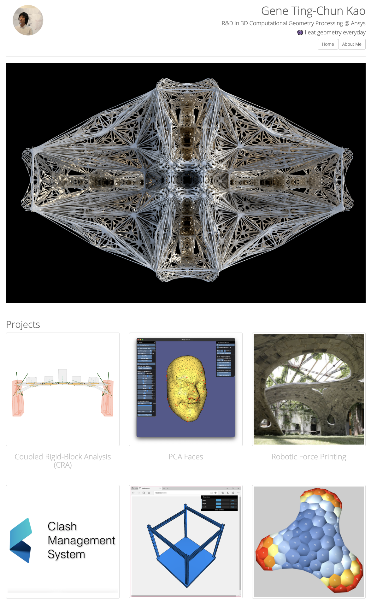
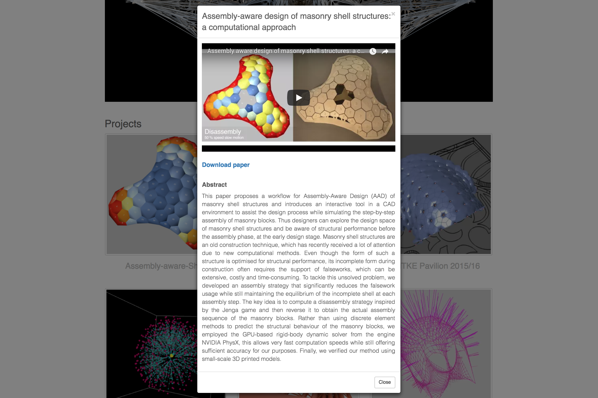

## GitHub Website

> developed with &#9829; by [Gene Ting-Chun Kao](https://geneatcg.com)

This portfolio is using [bootstrap](http://getbootstrap.com/) framework. It is a responsive web design so the layout will be adjusted according to the size of the web browser or screen.  

## Highlight
In the HTML file [modal window](https://www.w3schools.com/bootstrap/bootstrap_modal.asp) is used, so more information will show up by clicking the picture or About Me button. 

## Contact
Any suggestion please contact [me](https://github.com/GeneKao).